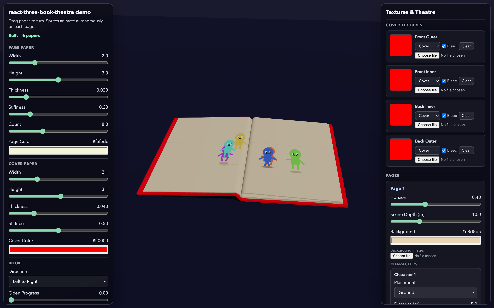
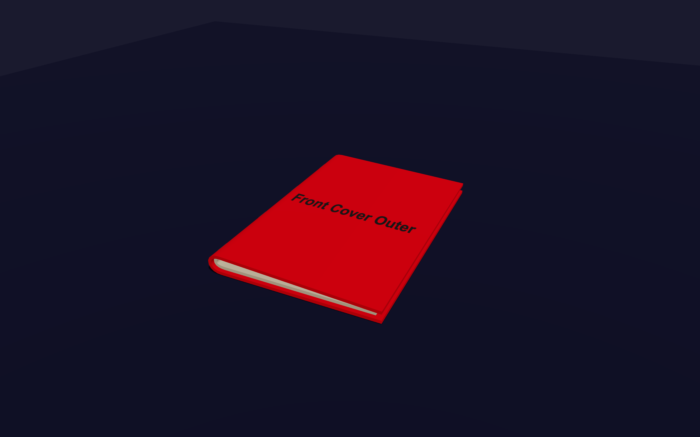
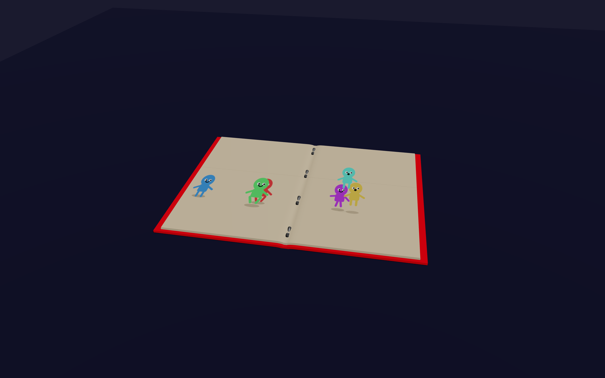

# @objectifthunes/react-three-book-theatre

React Three Fiber integration for [three-book-theatre](https://www.npmjs.com/package/@objectifthunes/three-book-theatre). Adds sprite theatre scenes (animated characters, static elements, parallax depth) to book pages inside the `<Book>` component from [@objectifthunes/react-three-book](https://www.npmjs.com/package/@objectifthunes/react-three-book).

The theatre core (`SpriteScene`, `Sprite`, `Element`, perspective helpers) is embedded natively -- no separate `three-book-theatre` dependency needed.



## Install

```bash
npm install @objectifthunes/react-three-book-theatre @objectifthunes/react-three-book three @react-three/fiber react
```

## Quick start

```tsx
import {
  Book, BookContent, BookInteraction, StapleBookBinding,
  SpriteScene, SpriteSceneUpdater, useBookContent,
} from '@objectifthunes/react-three-book-theatre';

function MyBook() {
  // Create a sprite scene per page
  const scenes = useMemo(() => [
    new SpriteScene({
      width: 512, height: 512,
      background: '#e8d5b5',
      horizonFraction: 0.4,
      pageDistance: 10,
    }),
  ], []);

  // Add characters
  useEffect(() => {
    scenes[0].addSprite({
      placement: 'ground',
      distance: 5,
      intrinsicSize: 100,
      idleImage: myCharImg,
    });
  }, []);

  const content = useBookContent(() => {
    const c = new BookContent();
    c.pages.push(scenes[0].texture);
    return c;
  }, []);

  const binding = useMemo(() => new StapleBookBinding(), []);

  return (
    <Book content={content} binding={binding}>
      <BookInteraction />
      <SpriteSceneUpdater scenes={scenes} />
    </Book>
  );
}
```

## New exports

| Export | Type | Description |
|---|---|---|
| `<SpriteSceneUpdater>` | Component | Place inside `<Book>` -- calls `scene.update(dt, book)` every frame via `useFrame` |
| `useSpriteScene()` | Hook | Create and auto-dispose a single `SpriteScene` |
| `useSpriteScenes()` | Hook | Create and auto-dispose an array of `SpriteScene` instances |

## Embedded core exports

All core classes from three-book-theatre are re-exported:

`SpriteScene`, `Sprite`, `Element`, `Positionable`, `drawImageFit`, `groundR`, `skyR`, `depthScale`, `renderedSize`

## Re-exported from react-three-book

The full react-three-book API is re-exported so consumers only need a single import:

`Book`, `BookInteraction`, `BookContext`, `useBook`, `useBookRef`, `usePageTurning`, `useBookControls`, `useAutoTurn`, `useBookState`, `useBookContent`, `createPageTexture`, `loadImage`, `ThreeBook`, `BookContent`, `BookDirection`, `BookBinding`, `StapleBookBinding`, and more.

## Screenshots

| Closed | Open | Demo UI |
|---|---|---|
|  |  |  |

## Development

```bash
pnpm install
pnpm build              # build the library
pnpm dev                # build library + run demo
```

## License

MIT
